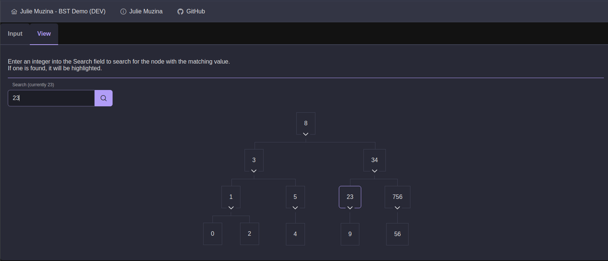

# Typescript implementation of BST

## Usage
1. Get the app running. There are two options:
    1. Local compilation
        1. Install [NodeJS](https://nodejs.org)
        2. With your working directory as `typescript`, execute `npm i` to install dependencies
        3. Execute `npx ng serve -o` to start and open a local Angular development server.
    2. Visit the [Live site](https://bst.jmuzina.io)

## Paradigm
The Typescript implementation makes use of the following paradigms:
- Object-oriented:
    - UI components are divided into component classes with single responsibilities. 
    - BST tree data and functionality encapsulated inside its own class.
    - Some cross-cutting functionality is accessible throughout the application through dependency injection. Currently, this is just the `ToStringPipe` used to let html templates use `{{val | toString}}`.
- Imperative: Within functions, control flow proceeds in an imperative fashion.

# Angular boilerplate details

This project was generated with [Angular CLI](https://github.com/angular/angular-cli) version 17.0.6.

## Install dependencies

Run `npm i` to install all Angular dependencies.

## Development server

Run `npx ng serve` for a dev server. Navigate to `http://localhost:4200/`. The application will automatically reload if you change any of the source files.

## Build

Run `ng build` to build the project. The build artifacts will be stored in the `dist/` directory.

## Further help

To get more help on the Angular CLI use `ng help` or go check out the [Angular CLI Overview and Command Reference](https://angular.io/cli) page.
